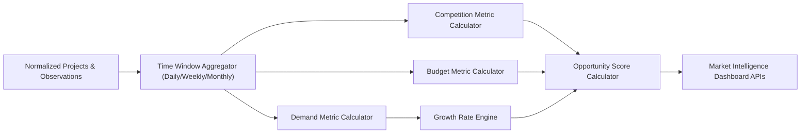

# مواصفات محرك التحليلات والاتجاهات (Analytics & Trend Engine Specification)

## 1. تدفق البيانات التحليلية (Analytics Pipeline)

---

## 2. المعادلات والمؤشرات الأساسية (Core Formulas)

### 1. Demand Volume & Share
* **حجم الطلب (Demand Volume):** عدد المشاريع المطابقة للبُعد/التصنيف خلال الفترة المستهدفة \( T \).
* **حصة الطلب (Demand Share):**
  \[
  \text{Demand Share \%} = \frac{\text{Demand Volume of Term } X}{\text{Total Projects in Period } T} \times 100
  \]

### 2. Growth Rate (معدل النمو)
* **نسبة التغير (WoW / MoM):**
  \[
  \text{Growth Rate \%} = \frac{\text{Volume}(T_{\text{current}}) - \text{Volume}(T_{\text{previous}})}{\text{Volume}(T_{\text{previous}})} \times 100
  \]

### 3. Competition Intensity (شدة المنافسة)
* **متوسط العروض:**
  \[
  \text{Average Bids} = \frac{\sum \text{Bids Count}}{\text{Demand Volume}}
  \]

### 4. Opportunity Score (مؤشر الفرصة)
\[
\text{Opportunity Score} = (w_{\text{demand}} \cdot \overline{D}) + (w_{\text{growth}} \cdot \overline{G}) + (w_{\text{budget}} \cdot \overline{B}) - (w_{\text{competition}} \cdot \overline{C})
\]
*(حيث تتم معايرة القيم \(\overline{D}, \overline{G}, \overline{B}, \overline{C}\) بين 0 و 100، وتُحدد الأوزان \(w\) من شاشة الإعدادات).*
