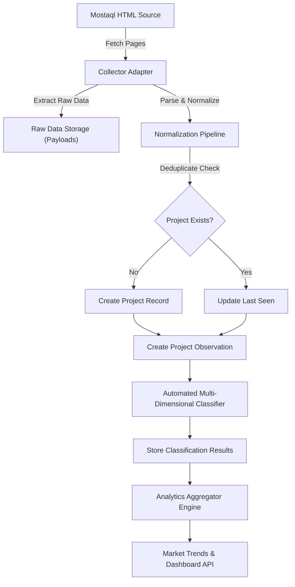

# المعمارية التقنية والهيكلية (System Architecture)

## 1. الطبقات المعمارية (Architectural Layers)

تم تصميم النظام باتباع مبادئ **Clean Architecture / Hexagonal Architecture** لضمان عدم وجود أي اعتمادية مباشرة بين مصادر البيانات الخارجيّة (Collector) وحفظ البيانات (Database) أو الواجهات (Frontend).

```
                      ┌─────────────────────────────────────────┐
                      │            Presentation Layer           │
                      │  (React UI / REST APIs / Controllers)   │
                      └────────────────────┬────────────────────┘
                                           │
                                           ▼
                      ┌─────────────────────────────────────────┐
                      │            Application Layer            │
                      │  (Use Cases / Orchestrator / Scheduler) │
                      └────────────────────┬────────────────────┘
                                           │
                                           ▼
                      ┌─────────────────────────────────────────┐
                      │              Domain Layer               │
                      │ (Entities / Taxonomy / Analytics Engine)│
                      └────────────────────▲────────────────────┘
                                           │
                                           │ (Interfaces Implementation)
                      ┌────────────────────┴────────────────────┐
                      │           Infrastructure Layer          │
                      │ (SQLite / Collectors / HTTP Adapters)   │
                      └─────────────────────────────────────────┘
```

---

## 2. المكونات الرئيسية للنظام (Core Components)

1. **Collector Subsystem:**
   * `MostaqlHtmlCollectorAdapter`: يستخرج بيانات المشاريع والصفحات من المصدر الخام.
   * `CollectionJobRunner`: يدير دورة حياة عملية الجمع (Historical أو Daily) ويسجل الأحداث والأخطاء في `CollectionRun`.
   * `RateLimiter / RetryHandler`: يحمي عمليات HTTP من التوقف التلقائي ويحترم سياسة الاستخدام.

2. **Core Domain & Storage Subsystem:**
   * `ProjectEntity`: الكيان الأساسي المعرف بـ `source_project_id`.
   * `ProjectObservationEntity`: سجل القراءات اللحظية (العروض، الحالة، التحديثات).
   * `RawPayloadStore`: تخزين كامل الـ HTML أو الـ JSON الخام المستخرج للمستقبل.

3. **Taxonomy & Classification Subsystem:**
   * `MultiDimensionalTaxonomy`: إدارة الأبعاد المفتوحة (Domain, Product Type, Technology, Service, Industry).
   * `AutomatedClassificationEngine`: مطابقة القواعد والكلمات المفتاحية واحتساب `confidence_score`.
   * `HumanReviewService`: اعتماد أو تعديل التصنيفات مع حفظ القيمة الأصلية للنظام.

4. **Analytics & Trend Subsystem:**
   * `TrendAggregator`: حساب مؤشرات الحجم، النسبة، والنمو عبر الشرائح الزمنية (Daily, Weekly, Monthly).
   * `OpportunityMatrixEngine`: حساب المؤشر التجميعي للفرص وسحب النقاط على المحاور المتعددة.

---

## 3. تدفق البيانات بين الطبقات (Data Flow Architecture)


