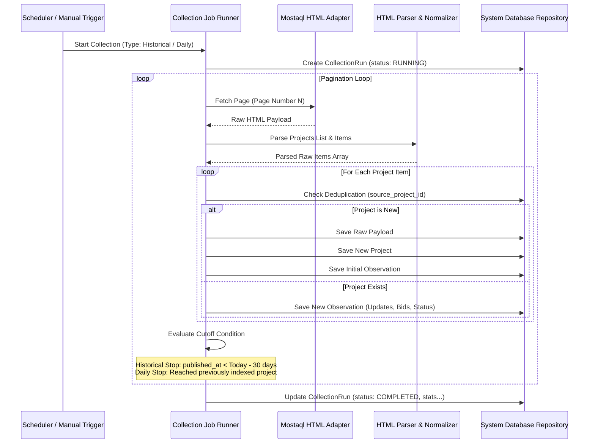

# مواصفات وآلية جمع البيانات (Collection System Specification)

## 1. مسار عملية الجمع (Collection Flow Architecture)

---

## 2. قواعد منع التكرار وحساب الملاحظات (Deduplication & Observations Rules)

1. **المعرف الأساسي للمصدر (`source_project_id`):** يُسحب مباشرة من رابط صفحة المشروع (مثال: `https://mostaql.com/project/1145920` -> `1145920`).
2. **عند اكتشاف مشروع جديد:**
   * إنشاء سجّل بجدول `projects`.
   * حفظ الاستجابة كاملة بجدول `raw_payloads`.
   * حفظ السجل الزمني الأول بجدول `project_observations`.
3. **عند اكتشاف مشروع مكرر:**
   * عدم تعديل البيانات الأساسية الأولى التي لا تتغير.
   * إضافة سجل جديد بجدول `project_observations` إذا تغير عدد العروض أو ميزانية أو حالة المشروع.
   * تحديث `last_seen_at` بجدول `projects`.

---

## 3. التعامل مع الأخطاء واستعادتها (Fault Tolerance & Error Recovery)

* **تعليق الشبكة / الفشل الفردي:** لا تؤدي أي استجابة خاطئة لصفحة فردية إلى إيقاف العملية؛ يتم تسجيل الخطأ بجدول الـ Log ومتابعة الصفحات التالية.
* **الجدولة الآمنة (Re-entrant Protection):** يمنع النظام تشغيل عمليتي جمع متزامنتين في نفس الوقت عبر الـ `Lock Manager`.
