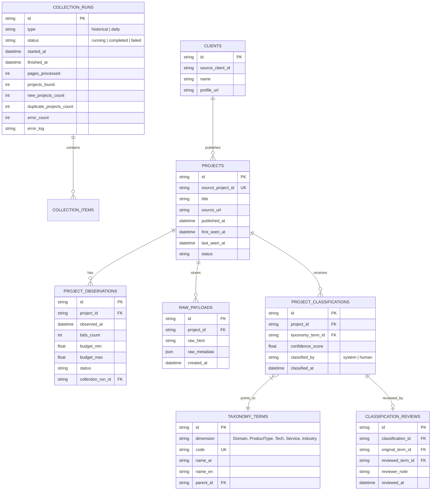

# نموذج البيانات ومواصفات الجداول (Data Model & ERD)

## 1. مخطط الكيانات والعلاقات المنطقي (Logical ERD)

---

## 2. مبررات النموذج الكياني (Entity Rationale)

* **الفصل بين `PROJECTS` و `PROJECT_OBSERVATIONS`:**
  المشروع بصفته كيانًا له هوية ثابتة برقم `source_project_id` ومعلومات أساسية (العنوان، الرابط، تاريخ النشر الأول). أما الملاحظات الزمنيّة (`PROJECT_OBSERVATIONS`) فتتبع رصد تطور عدد العروض والحالة بمرور الوقت دون مسح السجل السابق.

* **جدول `RAW_PAYLOADS` المستقل:**
  ضمان استرجاع كامل الاستجابة الخام لتفادي فقدان أي attribute جديد يتم التعرف عليه لاحقاً.

* **جدول `TAXONOMY_TERMS` متعدد الأبعاد:**
  عدم ربط المشاريع بـ `category` و `sub_category` تقليديتين فقط، بل دعم مصطلحات مصفوفة عبر أبعاد مختلفة (Domain, Product Type, Tech Stack, Service, Industry).

* **حفظ تتبع المراجعة `CLASSIFICATION_REVIEWS`:**
  الاحتفاظ بالنتيجة التي وصل لها الذكاء الاصطناعي/النظام القواعدي مقترنة بتعديلات المستخدم البشري لتدريب وإصلاح الخوارزميات لاحقًا بدون ضياع التاريخ.
